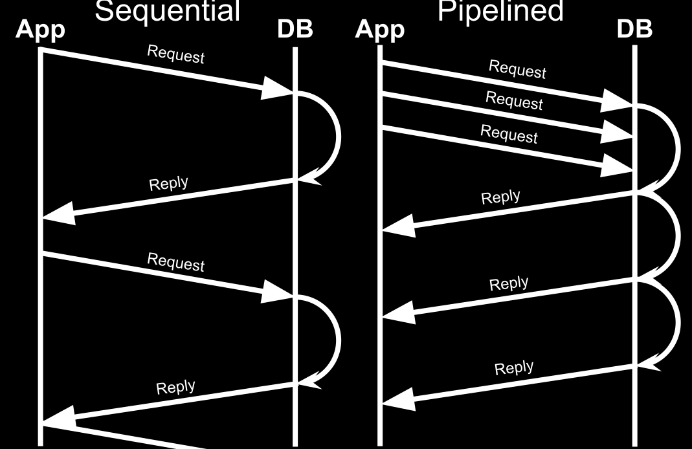

.. role:: hidden
   :class: hidden

All Things Async
================

Why Async?
==========

To Save Memory
==============

:hidden:`Metrics`
=================

* 500 Mb process
* 100 ms response time
* **70%** serving requests
* 7 RPS
* 5% CPU usage

Sync → Async
=============

* 500 Mb process
* 103-105 ms response time
* 100 RPS
* 70% CPU usage

Warning: code ahead!
====================

Example
=======

.. code-block:: python

   async def combine_things(http, u1, u2):
        value1 = await get_json1()
        value2 = await get_json2()
        return combine(value1, value2)

Simultaneous
============

.. code-block:: python

   def combine_things(http, u1, u2):
        (value1, value2), _ = await asyncio.wait([
            get_json1(u1),
            get_json2(u2),
        ])
        return combine(value1, value2)

Request Timeout
===============

.. code-block:: python

    with aiohttp.Timeout(10):
        async with session.get(url) as response:
            assert response.status == 200
            return await response.read()

Atomicity
=========

.. code-block:: python

    async def transfer(amount, payer, payee, server):
        if not payer.sufficient_funds(amount):
            raise InsufficientFunds()
        payee.deposit(amount)
        log_transfer(amount)
        payer.withdraw(amount)
        await server.update_balances([payer, payee])

Greenlets
=========

.. code-block:: python

    async def transfer(amount, payer, payee, server):
        with payer.lock(), payee.lock():
            if not payer.sufficient_funds(amount):
                raise InsufficientFunds()
            payee.deposit(amount)
            log_transfer(amount)
            payer.withdraw(amount)
        server.update_balances([payer, payee])

Greenlets: No Monkeypatching!
=============================

:hidden:`Pipelining`
====================

